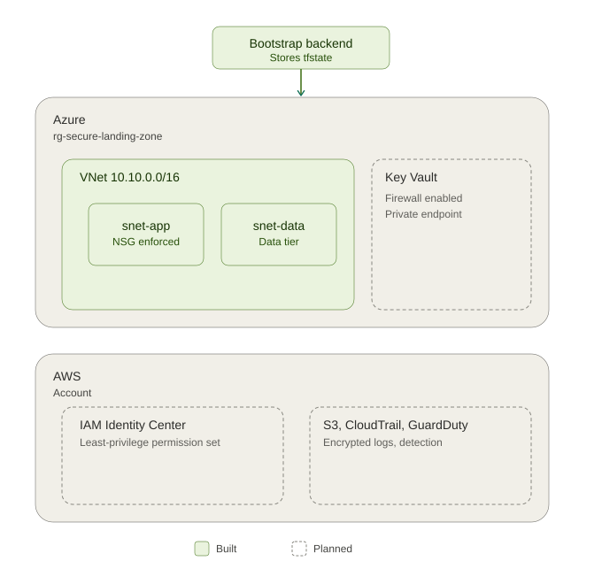

# Cloud Security Landing Zone

A secure-by-design Azure + AWS landing zone built with Terraform, demonstrating network segmentation, secrets hardening, policy-as-code governance, least-privilege identity, and detection/logging — built as hands-on preparation for AZ-500 (Azure Security Engineer).

## Why this exists

15 years of Windows/VMware infrastructure and Azure/AWS operations work, applied specifically to security controls: deny-by-default networking, firewalled secrets management, enforced tagging/compliance policy, least-privilege IAM, and centralized logging with automated threat detection.

## Architecture



Green = built. Dashed outline = planned.

## Build progress

| Module | Layer | Control | Status |
|---|---|---|---|
| 0. Bootstrap | — | Remote Terraform state backend (Azure Storage, firewalled, versioned, soft-delete) | ✅ Done |
| 1. Network | IaaS | Deny-by-default NSG rules; app/data subnet isolation | ✅ Done |
| 2. Key Vault | PaaS | Firewall (`default_action = Deny`) + private endpoint; no public network access | 🚧 Planned |
| 3. Policy | Governance | Deny-effect policy blocking untagged resource creation | 🚧 Planned |
| 4. IAM (AWS) | Identity | Least-privilege permission set (read-only security audit access, not admin) | 🚧 Planned |
| 5. Logging & Detection | Cross-cutting | Multi-region CloudTrail with log file validation; GuardDuty S3 threat detection | 🚧 Planned |

## Verification approach

Each module is verified by actually triggering the control, not just declaring it in code:

- **Network**: `az network nsg rule list` confirms the explicit deny sits at priority 4096
- **Key Vault**: a secret write attempted from outside the VNet is expected to fail with a firewall error (deliberately triggered)
- **Policy**: a test resource created without the required tag is expected to be denied; confirmed via `az policy state list`
- **IAM (AWS)**: login via the assigned permission set confirms read access without write/modify capability
- **Logging**: `aws cloudtrail get-trail-status` confirms `IsLogging: true`; a GuardDuty sample finding is generated to validate detection

## Tech stack

- **Terraform** (`~> 3.100` for AzureRM, `~> 5.0` for AWS) — pinned deliberately to avoid unplanned major-version schema drift
- **Azure**: Resource Groups, VNet/Subnets, NSGs, Key Vault, Private Endpoints, Azure Policy
- **AWS**: IAM Identity Center, S3, CloudTrail, GuardDuty

## Repo structure

```
cloud-security-landing-zone/
├── bootstrap/            # Remote state backend — separate lifecycle, deliberately not merged
│   ├── main.tf
│   ├── variables.tf
│   └── output.tf
├── azure/
│   ├── versions.tf        # includes the remote backend block
│   ├── main.tf            # RG, VNet, subnets
│   ├── network.tf
│   └── nsg.tf
├── aws/                   # planned — permission sets, S3, CloudTrail, GuardDuty
└── docs/
    ├── README.md
    └── architecture.svg
```

`bootstrap/` is kept separate from `azure/` on purpose: different lifecycle (created once, rarely changes), different state (must stay local to avoid a circular dependency), and a deliberately smaller blast radius so a `destroy` in the main config can never touch the thing storing its own state.

## Notes

- All resources were built and torn down in a personal sandbox subscription/account — no production or employer infrastructure was used.
- State files, `.tfvars`, and provider caches are excluded via `.gitignore` and were never committed.
- This repo is a living project — modules are added incrementally as part of a structured AZ-500 → CISSP certification path.
